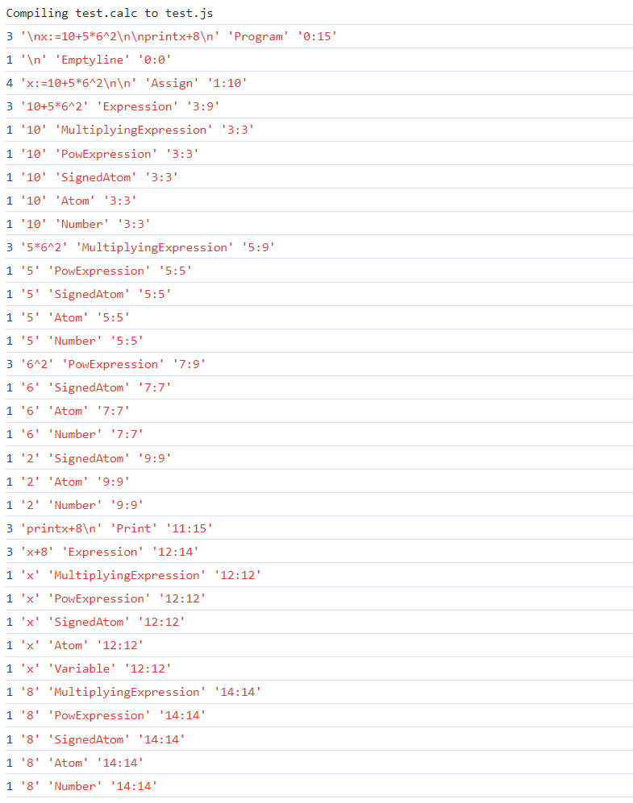

# Javascript-Browser-Parser-ANTLR
using javascript to parser code dynamically and hight code

not completed


## 先测试一个简单的例子，搞清楚怎么用，接着再具体分析语言

下载了两个项目，共同作为参考。
分别为： https://www.scriptol.com/programming/antlr4-javascript.php 以及 https://github.com/program-in-chinese/quan4

前者详细讲解了如何去用 Antlr 构建一个可用在javascript运行的编译器。后者实际写了一个网页，但是它又用了一个名为 browserify 的东西把它实际转成了 es6 单一文件 js 。这看上去挺好，但是我们无法分析结构了，并且在处理多语言时会有很大的困难。
因此，我们选择一第一个的node项目为主。

目前我的网页没有使用任何框架，因此我不希望在每次修改后，都需要本地编译一次。
而 ANTLR 一个好处是，我用 `npm install antlr4` 安装的 antlr4 是完全 ES6 化的，可用直接在浏览器运行。
~~其实不完全是~~，antlr4 有一个 `FileStream.js` 中使用了node特有库 `fs`
```javascript
// node_modules\antlr4\src\antlr4\FileStream.js
import fs from 'fs';
```
我们需要注释掉 import 那一行即可完全没有问题的使用了。

### 前期准备

- java
- node_modules\antlr4
- antlr.jar   (后面会有版本号等，但不影响)
- 你自己的编译器.g4

**具体安装：**

*java*我就不讲了
*node_modules\antlr4* 使用命令就会自动在根目录下创建 `node_module\antlr4\*` 一系列文件：
```bash
npm install antlr4
```
*antlr.jar *到官网上直接下载 [(官网链接)](https://www.antlr.org/download.html) ，或者如果找不到点哪里就安装写本文时的最新版 [4.13.1版本](https://www.antlr.org/download/antlr-4.13.1-complete.jar) 
*你自己的编译器.g4* 自己找一个，建议简单一点的，比如Test文件夹里的一个简易的 [calc.g4](./test/calc.g4)

### 使用方法

使用起来非常 easy ，网上写的你未必能正常跑，只要配好了 java 环境，在 calc.g4 的路径下直接在控制台(注意JavaScript要大写)：
```bash
..\antlr.jar -Dlanguage=JavaScript calc.g4
```

然后就会输出一大堆文件。
我们用的到的有
- calcLexer.js
- calcListener.js
- calcParser.js

这三个 javascript 文件。

#### 编写我们的网页

我们的关键性代码只有几行 `my_calc.js`：
```javascript
// 首先，引入库
import antlr4 from "../node_modules/antlr4/src/antlr4/index.web.js"
import calcLexer from "./calcLexer.js"
import calcParser from "./calcParser.js"
import JSListener from "./JSListener.js"

// 然后，定义我们的输入
var input = `\n x := 10 + 5 \n print x + 8 \n`;

// 然后，生成输入流，传入词法分析器，传入语法解释器，创建抽象语法树
var chars = new antlr4.InputStream(input)
var lexer = new calcLexer(chars)
var tokens = new antlr4.CommonTokenStream(lexer)
var parser = new calcParser(tokens)
parser.buildParseTrees = true
var tree = parser.program()

// 最后，从树中提取流程，将编译结果用 js 代码打印
var extractor = new JSListener()
antlr4.tree.ParseTreeWalker.DEFAULT.walk(extractor, tree)
```

四个导入中，第一个是库，第二个是生成的词法分析器，第三个是生成的解释器，第四个是需要我们完成的翻译器。

库的部分没什么好说的，注意路径要正确（还有前面说过的改掉一个import）。其实所有的相关代码都是放在 `/node_modules/antlr4/src/` 目录下的，因此也可以只保留这一个目录到其它路径，剩余的就不要了。
中间两个导入的库有一点要注意，那就是生成时使用的 antlr4 的的位置是 `antlr4` 因此我们把它们内部使用的 import 改为和 `my_calc.js` 一样的 antlr4 的路径。（calcListener.js 里的路径也要改）
最后一个是我们自己实现的 JSListener ，稍有复杂，关键代码见下：

```javascript
// 导入模板运行过程
import calcListener from './calcListener.js'

// 定义
class JSListener extends calcListener {};

// 重写一些方法
JSListener.prototype.exitAssign = function (ctx) {
    // 赋值完毕时调用
    var left_value = ctx.getChild(0).getText()
    var right_value = ctx.getChild(2).getText()
    console.log(left_value + " = " + right_value)
};
JSListener.prototype.exitPrint = function (ctx) {
    // 打印完毕时调用
    var output_text = ctx.getChild(1).getText()
    console.log(`console.log(${output_text})`)
};

// 导出类
export default JSListener;
```

或者我们其实也可以就地修改 `calcListener.js` ，向其中的方法中加入具体的执行过程。（我的项目里没有展示）

把这些都放在一起，再创建 `test.html` ：
```html
<html>
<head></head>
<body>
  <script type="module" src="my_calc.js"></script>
</body>
</html>
```
 其中， `type="module"` 是为了让我们的模块可用正常运行，不然无法再代码中使用 `import`

### Bingo! 它输出了

```javascript
x = 10+5
console.log(x+8)
```

你需要使用 go live 来预览你的网页，不然它不会加载这么多js

可用看到，总共资源为 0.5M 的大小，以及不是可用轻易忽略的size了。

对应 C 语言的大小，三个文件加起来一共 357KB ，也就接近 1M 的大小了。如果对应网速较差时，这不是一个易于接受的大小。考虑到优化，我们一方面可用打开缓存，另一方面还可以将不同语言的分别保存，仅需要时再调用。同时，将 ANTLR 和 语言 部分的代码分离，增加重复利用率。

### 迁移到词性分类(为高亮做准备)

进一步修改代码，尝试更高级地打印出每一段：
我们在每一个


### QA

> 为什么我不用 node 测试

**你以为我不想吗！** 我仿照着示例 `node calc.js test.calc` 然后你猜怎么着？它报错了，我还看不懂。